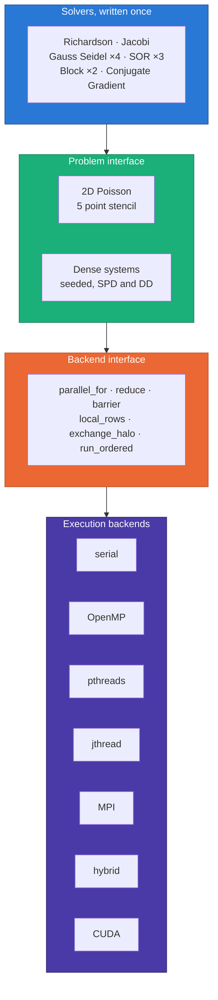
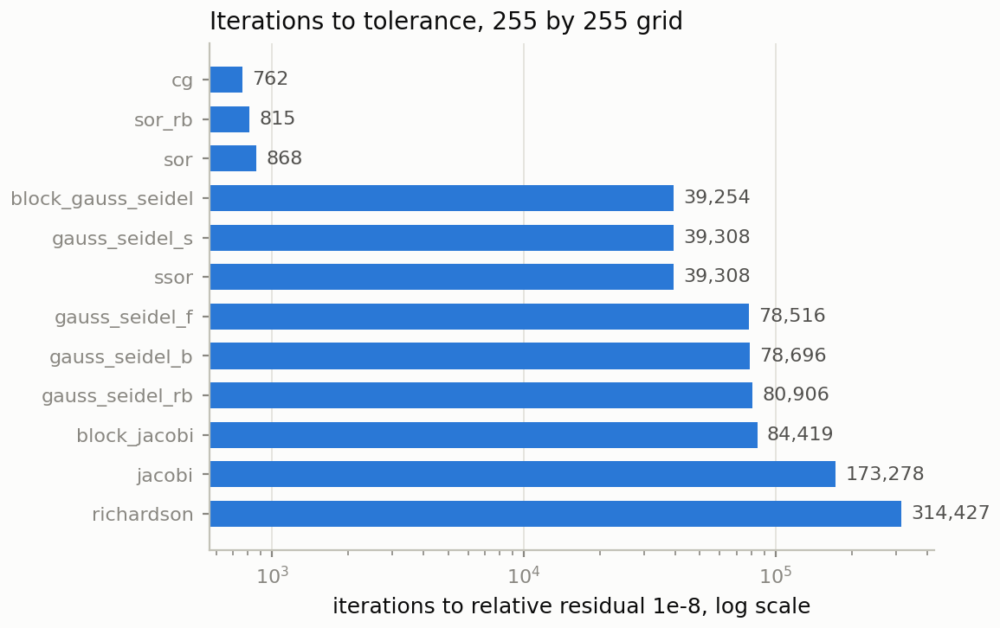
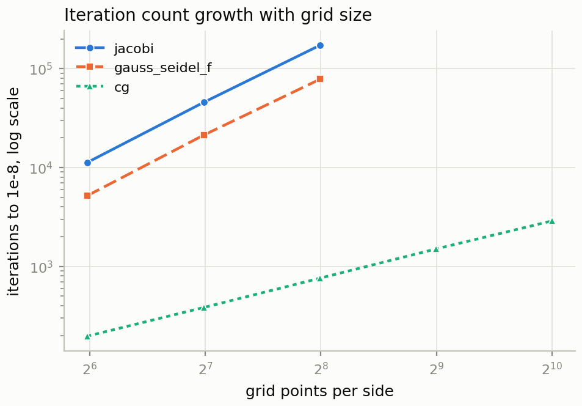
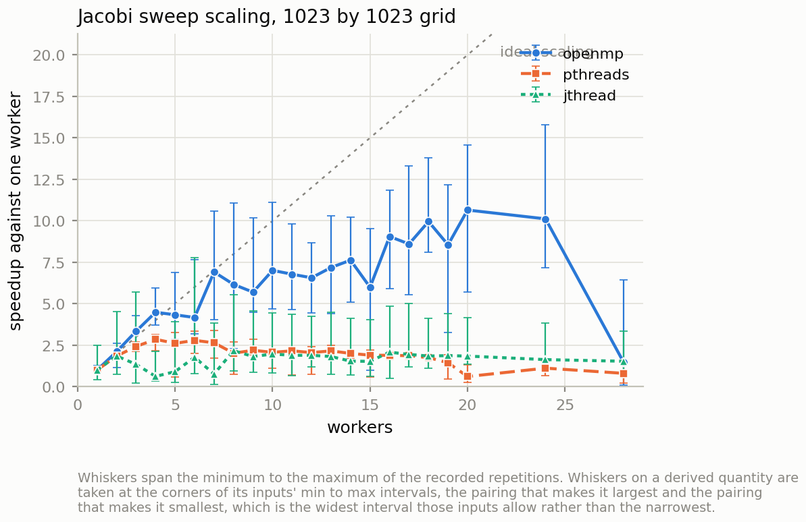
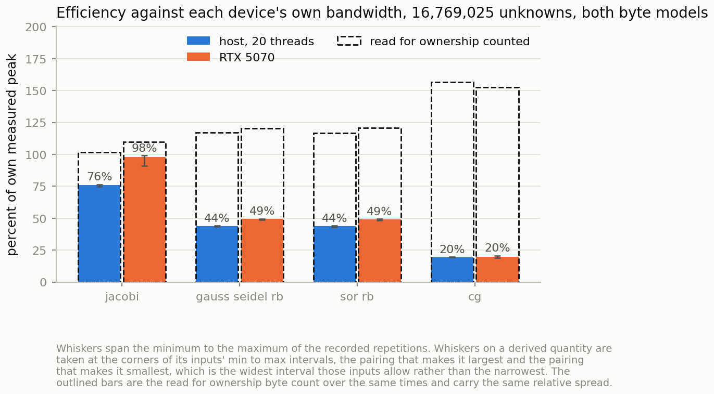
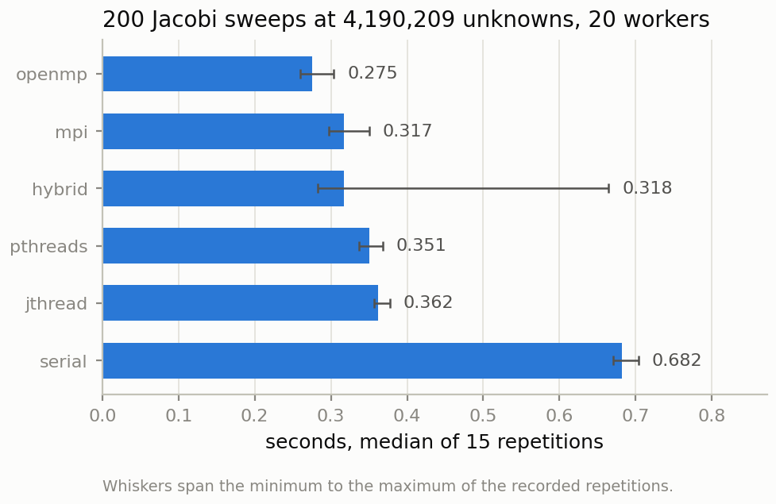
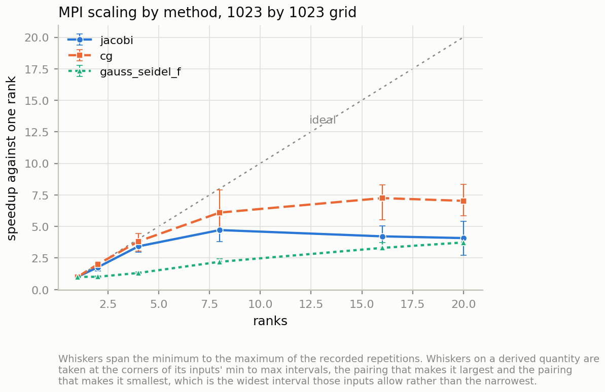

# Parallel Numerical Library  

**Twelve iterative linear solvers, written once, running unchanged over seven
execution backends: serial, OpenMP, POSIX threads, `std::jthread`, MPI, hybrid
MPI with threads, and CUDA.**

[](https://github.com/Olajide-Badejo/Parallel-Numerical-Library/actions/workflows/ci.yml)
[](https://en.cppreference.com/w/cpp/23)
[](https://developer.nvidia.com/cuda-toolkit)
[](LICENSE)

📄 **[Main report (37 pages)](assets/reports/main_report.pdf)** &nbsp;·&nbsp;
🔧 **[Engineering report (16 pages)](assets/reports/debug_report.pdf)** &nbsp;·&nbsp;
📊 **[Raw results](experiments/results/summary.csv)**

---

## What this project answers

The interesting question about parallel programming is not "is OpenMP fast." It
is **what does each programming model actually cost on identical work.**

That question is normally impossible to answer cleanly, because a study that
reimplements an algorithm per model ends up measuring the care that went into
each reimplementation. This library removes that variable by construction: a
solver never knows which backend it is running on, and a backend never knows
which solver it is running. The only thing that differs between two measurements
is the execution model.

### The invariant that makes it work

> **Every shared memory backend, at every worker count, produces bit identical
> iterates. The GPU sweeps are bit identical to the CPU as well.**

Not "close." Not "within tolerance." *Identical*, asserted as exact equality by
the test suite across twelve solvers, two problem families, four backends and
seven worker counts.

Floating point addition is not associative, so a reduction's answer normally
depends on how many threads computed it. This library refuses to let that vary:
the reduction chunk grid is fixed by the problem size alone and never by the
worker count, so partial sums are always combined in the same order.

Two limits are documented rather than hidden. Across MPI **rank** counts results
agree to reduction tolerance, because rank boundaries are chosen for load balance
and do not align with the chunk grid. GPU **reductions** use a tree, which is not
an ordered sum.

---

## Architecture



A solver expresses itself as a *sweep*; the problem supplies the sweep
primitives; the backend supplies the parallelism. No backend leaks its own types
through the interface, so there is no `MPI_Comm`, no `omp_` type and no
`cudaStream_t` in any signature a solver can see.

---

## Results

All figures below are generated from
[`experiments/results/summary.csv`](experiments/results/summary.csv) by script.
Nothing is typed by hand, and 440 configurations were measured.

### 1. Classical convergence theory, verified rather than asserted

<picture>
  <source media="(prefers-color-scheme: dark)" srcset="assets/figures/iteration_counts-dark.png">
  
</picture>

Every convergence claim is checked against a closed form prediction, and all
pass:

| Claim | Theory | Measured |
| --- | --- | --- |
| Jacobi spectral radius | cos(πh) | matches to 1e-3 relative |
| Jacobi ÷ Gauss Seidel iterations | 2, since ρ<sub>GS</sub> = ρ<sub>J</sub>² | 2.00 within 2 percent |
| Optimal SOR factor | ω\* = 2 / (1 + sin πh) | a genuine minimum in both directions |
| Growth order, optimal SOR | O(n) not O(n²) | 216 → 432 → 868 as the grid doubles |
| Red black ordering penalty | small | 2.6 percent more iterations |
| Five point stencil accuracy | 2nd order, constant π²/12 = 0.8225 | order 2.00, constant 0.823 |

<picture>
  <source media="(prefers-color-scheme: dark)" srcset="assets/figures/convergence_growth-dark.png">
  
</picture>

The two families separate visibly: Jacobi and Gauss Seidel need O(n²) iterations,
while optimally relaxed SOR and conjugate gradient need O(n). That change of
*order* is the single largest improvement available inside the classical family.

### 2. A result that contradicted the original hypothesis

<picture>
  <source media="(prefers-color-scheme: dark)" srcset="assets/figures/scaling_speedup-dark.png">
  
</picture>

This project set out to find the performance core versus efficiency core knee on
a hybrid CPU. **It is not there.** The scaling knee sits at three to five
workers, and past it the slope turns slightly negative. At 28 workers OpenMP
falls *below* single threaded performance.

The bandwidth probe explains why, independently:

| workers | 2 | 4 | 8 | 12 | 16 | 20 | 24 | 28 |
| --- | --- | --- | --- | --- | --- | --- | --- | --- |
| host GiB/s | 42.4 | **62.3** | 61.2 | 60.0 | 56.8 | 56.7 | 54.7 | 37.7 |

The memory system is saturated by four workers. **The binding constraint is
memory bandwidth, not the core types.** This machine runs out of bandwidth long
before it runs out of fast cores. That finding would have been invisible to a
study that measured speedup without measuring the memory system separately.

### 3. CPU versus GPU, with the speedup decomposed

<picture>
  <source media="(prefers-color-scheme: dark)" srcset="assets/figures/device_efficiency-dark.png">
  
</picture>

Both devices are measured against **their own** STREAM triad bandwidth, measured
on this hardware and never quoted from a specification sheet: 62.3 GiB/s for the
host across all threads, 549.7 GiB/s for the RTX 5070.

That ratio of 8.8 is what a bandwidth bound kernel should reflect, and it does:

| method | host efficiency | GPU efficiency | predicted speedup | measured |
| --- | --- | --- | --- | --- |
| red black Gauss Seidel | 45.7 % | 47.1 % | 9.1 | 8.3 |
| red black SOR | 45.7 % | 47.2 % | 9.1 | 8.3 |
| conjugate gradient | 20.2 % | 20.1 % | 8.8 | 8.4 |
| Jacobi | 28.1 % | 93.8 % | 29 | 25 |

**For three of the four methods the two devices are used equally well**, so the
entire advantage is the memory system and nothing is attributable to the port.
Jacobi is the exception because the host implementation writes to a separate
array and pays a read for ownership on every cache line, which the GPU does not.

The honest summary: *on a bandwidth bound stencil sweep this GPU moves about nine
times more data per second than this CPU, and on three of four kernels that is
the whole of the difference.* See
[the comparison methodology](docs/comparison_methodology.md), written for a
reader who is about to quote a speedup out of context.

### 4. What each programming model costs

<picture>
  <source media="(prefers-color-scheme: dark)" srcset="assets/figures/backend_cost-dark.png">
  
</picture>

Because every backend computes bit identical values, these differences are
attributable to the execution model alone. Seconds for 200 Jacobi sweeps at
4.2 million unknowns, 20 workers:

| backend | Jacobi | red black GS | conjugate gradient |
| --- | --- | --- | --- |
| serial | 1.358 | 1.321 | 3.116 |
| OpenMP | 1.168 | 0.476 | 1.496 |
| pthreads | 1.097 | 0.552 | 1.538 |
| jthread | 1.125 | 0.592 | 1.597 |
| MPI | 8.616 | 0.489 | 1.396 |
| hybrid | 2.530 | 0.414 | 1.311 |

The three thread models land within 6 percent of one another on identical work,
which is itself the answer to the original question: at this granularity the
choice between OpenMP, pthreads and `std::jthread` is a choice about ergonomics,
not performance.

<picture>
  <source media="(prefers-color-scheme: dark)" srcset="assets/figures/mpi_scaling-dark.png">
  
</picture>

Two further costs were measured rather than assumed. A **dynamic schedule** costs
7 to 14 percent on uniform work, which is the evidence for leaving work stealing
out of the thread pool. **Deterministic reductions** cost between minus 5 and plus
3 percent against each model's native reduction, which is what reproducibility is
worth here.

---

## Quick start

```bash
make setup     # check the toolchain and report what is missing
make build     # configure and compile
make test      # every gate: unit, convergence, equivalence, MPI, CUDA, style
make sweep     # the benchmark matrix into experiments/results
make reports   # the PDFs
make all       # everything above, in order
```

MPI and CUDA are optional and detected. A build without either configures
cleanly and skips those backends.

```bash
# One configuration, one result row
./build/pnl --solver cg --backend openmp --size 1023 --workers 20

./build/pnl --list        # solvers and available backends
./build/pnl --topology    # probe and describe the CPU
./build/pnl --bandwidth   # measured STREAM triad, host and device
```

### Measured wall clock

From an actual `make clean && make all`, not an estimate:

| stage | measured |
| --- | --- |
| configure and build, 6 jobs | 55 s |
| full test suite, 10 binaries | 8 s |
| benchmark sweep, 440 configurations | 21 min 05 s |
| all reports | 25 s |
| **end to end** | **about 23 min** |

---

## Repository layout

```text
include/pnl/
  core/         types, exceptions, the diagnostics record on every result
  backend/      the interface, seven implementations, topology probing
  solvers/      twelve solvers: one splitting family plus conjugate gradient
  numerics/     root finding, quadrature, ODE, LU, QR, Thomas
  problems/     2D Poisson stencil, seeded dense systems
src/            backend implementations, CUDA kernels, the CLI driver
tests/          unit, convergence, equivalence, MPI, CUDA, style
benchmarks/     the declarative sweep matrix and its resumable driver
docs/           backends, solvers, comparison methodology, decisions, log
assets/         published reports and result charts
report/         LaTeX source for the main report
```

### Documentation

| Document | What it covers |
| --- | --- |
| [docs/solvers.md](docs/solvers.md) | The solver family tree and what each method buys |
| [docs/backends.md](docs/backends.md) | The interface contract and what each backend does underneath |
| [docs/comparison_methodology.md](docs/comparison_methodology.md) | How the CPU versus GPU comparison is built to be hard to misquote |
| [docs/DESIGN_DECISIONS.md](docs/DESIGN_DECISIONS.md) | Seventeen choices, with the alternatives that were rejected |
| [docs/ENGINEERING_LOG.md](docs/ENGINEERING_LOG.md) | Every significant fault: symptom, root cause, options, fix, verification |
| [PROGRESS.md](PROGRESS.md) | Phase by phase record with the gate each one passed |

The engineering log is worth a look. Five of the sixteen recorded faults produced
entirely *plausible* numbers rather than obvious failures, which is the failure
mode worth documenting: a solver that converges in one iteration for the wrong
reason will be believed.

---

## Numerical core

Beyond the linear solvers, each routine carries its convergence order as a tested
property:

- **Root finding**: bisection, Newton, Brent
- **Quadrature**: adaptive Simpson, Gauss Legendre with nodes computed rather
  than tabulated, Romberg
- **ODE**: classical RK4 and adaptive Dormand Prince 5(4)
- **Dense linear algebra**: LU with partial pivoting, Householder QR, Thomas

Every result carries value, error estimate, iteration count, evaluation count, a
converged flag and an explicit stop reason, so an unconverged answer can never be
consumed as though it had converged.

---

## Reproducing the results

Every result row carries the problem, solver, backend, worker count, rank count,
pinning policy, reduction mode, schedule, seed and the commit hash stamped into
the binary at configure time. Problems are generated from recorded seeds. The
sweep is resumable and merges atomically, and a configuration that fails or does
not apply is recorded as such rather than dropped.

```bash
git clone https://github.com/Olajide-Badejo/Parallel-Numerical-Library.git
cd Parallel-Numerical-Library
make setup && make all
```

### Environment these results came from

| | |
| --- | --- |
| CPU | Intel Core i7-14700K, 8 performance plus 12 efficiency cores, 28 threads |
| GPU | NVIDIA GeForce RTX 5070, 12 GB, sm_120, 48 SMs, driver 610.62 |
| OS | Windows 11 Pro, all work inside WSL2 Ubuntu 26.04 |
| Compiler | GCC 16.0.1, C++23, with GCC 14 as the CUDA host compiler |
| Build | CMake 4.4.0, Ninja 1.13.2 |
| MPI | OpenMPI 5.0.10 |
| CUDA | 13.3 |

The guest does not expose the hybrid core topology, and thread affinity binds to
a virtual processor the hypervisor may place anywhere. The library measures
rather than assumes, and states plainly what it could not establish.

---

## Licence

MIT. Copyright 2026 Olajide Badejo. See [LICENSE](LICENSE).
